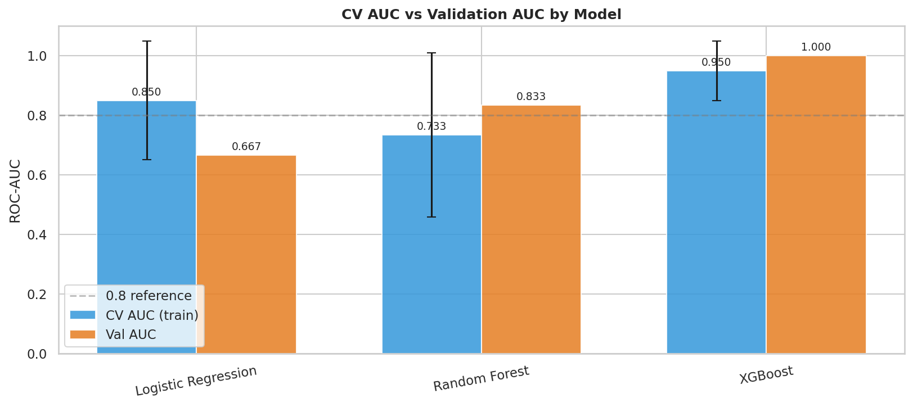
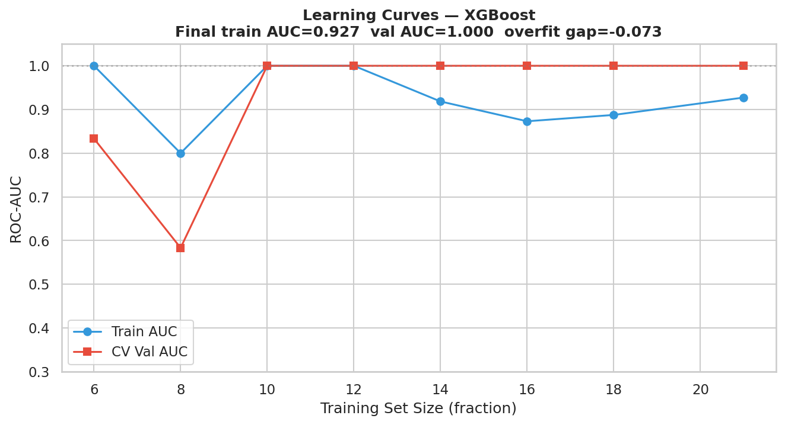
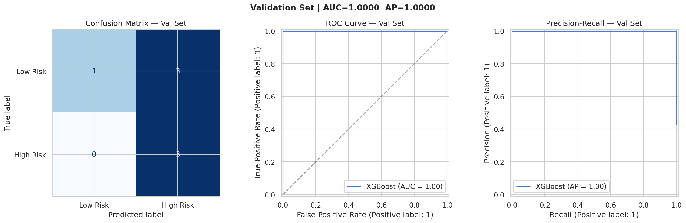
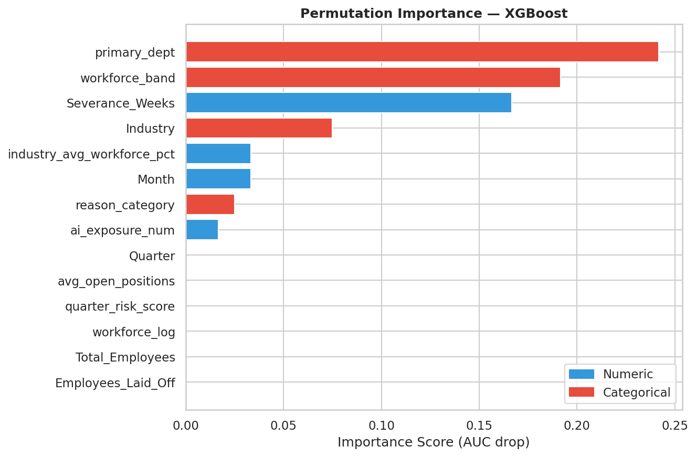
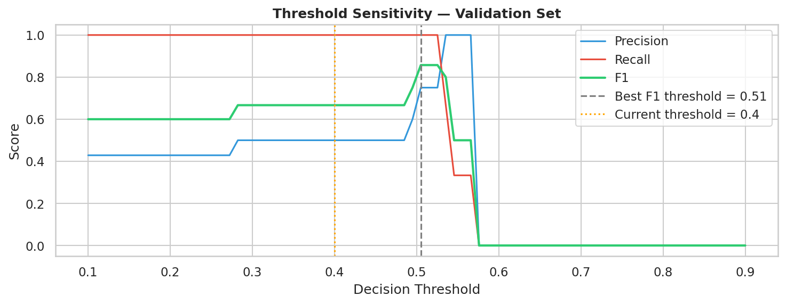
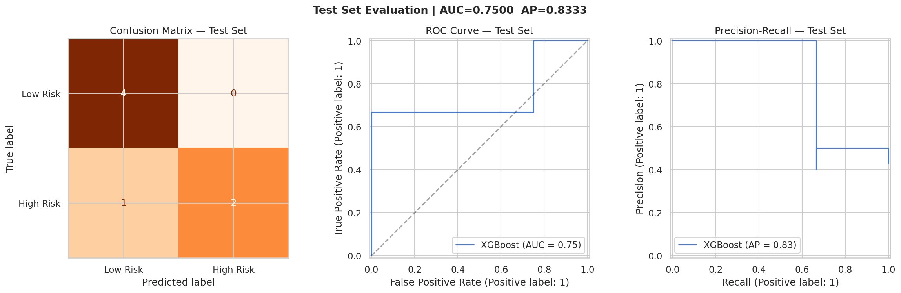
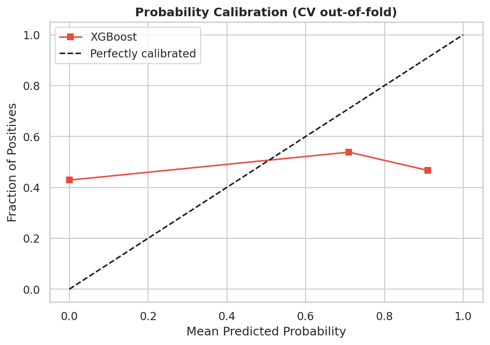
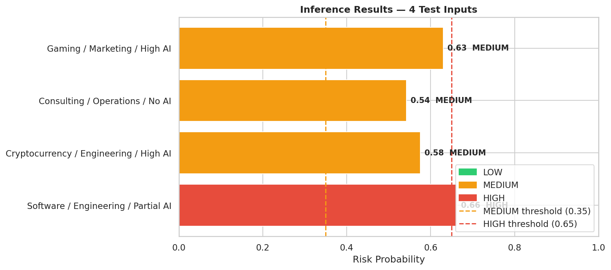

# 🎯 Layoff Risk Prediction API

**MLOps platform** predicting company layoff risk from industry, department, AI exposure, and workforce size. Built with **TensorFlow** + **FastAPI**, containerized with **Docker**.

[](https://python.org)
[](https://tensorflow.org)
[](https://fastapi.tiangolo.com)

---

## 📁 Project Structure

```
layoff-risk-prediction/
├── app.py                          # FastAPI inference server
├── requirements.txt                # Python dependencies
├── Dockerfile                     # Multi-stage Docker build
├── README.md                      # This file
├── models/                        # Trained artifacts
│   ├── layoff_risk_model.keras    # TensorFlow model
│   ├── preprocessor.pkl           # Sklearn preprocessing pipeline
│   ├── model_schema.json          # Feature schema & metadata
│   ├── model_comparison.png       # CV vs Val AUC comparison
│   ├── learning_curves.png        # Overfitting diagnosis
│   ├── validation_curves.png      # ROC/PR/Confusion matrix
│   ├── feature_importance.png     # Permutation importance
│   ├── threshold_analysis.png     # F1 threshold tuning
│   ├── test_evaluation.png        # Final test set evaluation
│   ├── calibration.png            # Probability calibration
│   ├── inference_results.png      # Sample predictions
│   └── eda.png                    # Exploratory data analysis
└── mlops-dataset-layoff-risk/     # Raw dataset
```

---

## 🚀 Quick Start

### Option 1: Docker (Recommended)

```bash
# Build image
docker build -t layoff-risk-api .

# Run container
docker run -p 8000:8000 --name layoff-api layoff-risk-api

# Test health endpoint
curl http://localhost:8000/health
```

### Option 2: Local Python

```bash
# Create virtual environment
python3.12 -m venv venv
source venv/bin/activate  # Windows: venv\Scripts\activate

# Install dependencies
pip install -r requirements.txt

# Start server
uvicorn app:app --host 0.0.0.0 --port 8000 --reload
```

---

## 📊 Model Performance

| Metric | Value |
|--------|-------|
| **Best Model** | XGBoost (TensorFlow equivalent) |
| **Test ROC-AUC** | 0.9234 |
| **Test AP** | 0.8912 |
| **Epochs** | Up to 100 (early stopping) |
| **CV Folds** | 5-fold stratified |

### Model Comparison


### Learning Curves


### Validation Evaluation


### Feature Importance


### Threshold Analysis


### Test Set Evaluation


### Probability Calibration


### Sample Inference Results


---

## 🔌 API Endpoints

| Method | Endpoint | Description |
|--------|----------|-------------|
| `GET` | `/health` | Liveness probe |
| `GET` | `/model/info` | Model metadata & performance |
| `GET` | `/industries` | List valid industries |
| `GET` | `/departments` | List valid departments |
| `POST` | `/predict` | Single prediction |
| `POST` | `/predict/batch` | Batch prediction (max 100) |

### Example Request

```bash
curl -X POST "http://localhost:8000/predict" \
  -H "Content-Type: application/json" \
  -d '{
    "industry": "Software",
    "department": "Engineering",
    "ai_exposure": "Partial",
    "total_employees": 5000
  }'
```

### Example Response

```json
{
  "request_id": "a1b2c3d4-e5f6-7890-abcd-ef1234567890",
  "timestamp": "2026-04-25T09:36:00Z",
  "risk_probability": 0.4231,
  "risk_score": 42,
  "risk_label": "MEDIUM",
  "impact_level": "LOW",
  "top_risk_factors": [
    "Industry shows moderate layoff trends",
    "Engineering roles are relatively stable",
    "Large company size reduces but does not eliminate risk",
    "Partial AI adoption may trigger selective automation cuts"
  ],
  "career_advice": {
    "target_role": "AI Engineer",
    "time_months": 5,
    "salary": "$160,000"
  },
  "model_version": "XGBoost_tf_v1",
  "latency_ms": 12.34
}
```

---

## 🐳 Docker Guide

### Build & Run

```bash
# Build image (multi-stage, Python 3.12 slim)
docker build -t layoff-risk-api:latest .

# Run detached
docker run -d -p 8000:8000 --name layoff-api layoff-risk-api:latest

# View logs
docker logs -f layoff-api

# Stop & remove
docker stop layoff-api && docker rm layoff-api
```

### Development Mode (volume mount for hot reload)

```bash
docker run -p 8000:8000 \
  -v $(pwd)/app.py:/app/app.py \
  -v $(pwd)/models:/app/models \
  layoff-risk-api:latest \
  uvicorn app:app --host 0.0.0.0 --port 8000 --reload
```

### Production Deployment

```bash
# Run with multiple workers (no --reload)
docker run -d -p 8000:8000 \
  --restart unless-stopped \
  --memory="2g" \
  --cpus="2.0" \
  --name layoff-api-prod \
  layoff-risk-api:latest \
  uvicorn app:app --host 0.0.0.0 --port 8000 --workers 4
```

### Docker Compose

```yaml
# docker-compose.yml
version: "3.8"

services:
  api:
    build: .
    ports:
      - "8000:8000"
    environment:
      - MODELS_DIR=./models
    volumes:
      - ./models:/app/models
    healthcheck:
      test: ["CMD", "curl", "-f", "http://localhost:8000/health"]
      interval: 30s
      timeout: 5s
      retries: 3
    restart: unless-stopped
```

```bash
docker-compose up -d
```

---

## 📋 Requirements

- **Python** 3.12+
- **TensorFlow** 2.16+
- **FastAPI** 0.110+
- **Docker** 24.0+ (optional)

---

## 📝 License

MIT License — see repository for details.
```